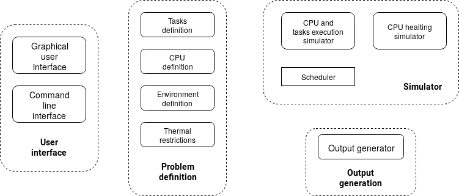

# Simulation environment for Real-Time Multiprocessor Schedulers

This is a tool to test real-time thermal aware schedulers.

With this tool in addition to seeing the schedule of the tasks set that performs your scheduler
you can see the warming that occurs in the processor over the execution

The tool manage periodic (sporadic) and aperiodic tasks execution, CPU and 
environment definition and variable CPU frequencies (the utilization of DVFS is assumed in the dynamic power consumption). 

It has an easy interface to define a new scheduler and a set of pre-loaded schedulers.

## Project components


## System requirements
This project has been developed using the Miniconda Python distribution with a Python version 3.7 installed (Can be downloaded from: [https://docs.conda.io/en/latest/miniconda.html](https://docs.conda.io/en/latest/miniconda.html)).

It's highly recommended to use the same Python distribution (or Anaconda) to avoid issues related with dependencies. However you can use another of your choice.

### Project dependencies (libraries)
The project needs the follow packages:

- Python 3.8 and all its dependencies
- scipy 1.5.2 or higher and all its dependencies
- matplotlib 3.3.1 or higher and all its dependencies
- jsonschema 3.2.0 or higher and all its dependencies
- progress 1.5 or higher and all its dependencies
- ffmpeg 4.1 or higher and all its dependencies
- pyqt 5.9.2 or higher and all its dependencies
- qt 5.9.2 or higher and all its dependencies (This package is necessary only if you want to modify the GUI)
- ortools 7.8.7959 and all its dependencies

If you are using Miniconda or Anaconda the next few lines will create an environment called rt-scheduler-simulation-environment with all project dependencies installed in it.

```bash
$ conda create -n rt-scheduler-simulation-environment python=3.8 scipy=1.5 matplotlib=3.3 jsonschema=3.2 pyqt=5.9 ffmpeg=4.2
$ conda activate rt-scheduler-simulation-environment
$ pip install ortools
```

## Usage
Once you have filled the requirements listed in the above section and have downloaded the repository, place in the project root folder.

There are two python Scripts, one for the Command Line Interface and other for the Graphical User Interface.

### Command Line Interface
To launch the Command Line Interface execute the script called cli_launcher.py.

This script takes two arguments
- -f, --file: Path where find the JSON simulation description file
- -v, --verbose \[Optional\] : Display simulation progress and execution time

```bash
$ python cli_launcher.py
```

You can find a description of the JSON input file in [JSON-Schema](https://json-schema.org/) format at [./main/ui/cli/input_schema/global-schema.json](tertimuss_cli/input_schema/global-schema.json).

Some examples are located in [./tests/cli/](tests/old/cli).

### Graphical User Interface
To launch the Graphical User Interface execute the script called gui_launcher.py.

```bash
$ python gui_launcher.py
```

## For developers only
### Modifications on the GUI
To modify the GUI is recommended to use the Qt Designer.

To launch it execute the following command:
```bash
$ designer
```

Once you have modified the XML (.ui) file that you create with Qt Designer, you have to transform it into a Python file.
To do it, just execute the following command (changing foo and bar for the files names):

```bash
$ pyuic5 foo.ui -o bar.py
```

### Add a new scheduler to the environment
To add a new scheduler to the environment, you have to create a new class in the main.core.schedulers.implementations package that extends from main.core.schedulers.templates.abstract_base_scheduler.AbstractBaseScheduler or from main.core.schedulers.templates.abstract_scheduler.AbstractScheduler.

Next, you have to add his name to the main.ui.common.SchedulerSelector class.

## License
The code in this repository, unless otherwise noted, is GNU GPLv3 licensed. See the `LICENSE` file in this repository.

## References
This work is part of the degree dissertation of [Abel Chils Trabanco](https://github.com/AbelChT/).

It is an improvement of a previous environment created in MATLAB that can be found in the following link:
[http://www.cys.cic.ipn.mx/ojs/index.php/CyS/article/view/3204](http://www.cys.cic.ipn.mx/ojs/index.php/CyS/article/view/3204).
