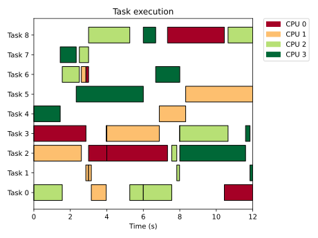

# Tertimuss: Simulation environment for Real-Time Multiprocessor Schedulers


Tertimuss is an evaluation tool for real-time multiprocessor schedulers. A user-friendly interface makes the scheduler implementation and evaluation easier. It is primarily designed for tentative design phase of a scheduling algorithm, where some computer architectural restrictions can be obviated.  
Using Tertimuss you can execute simulations using your own scheduler implementation, or one of the RT multiprocessor schedulers already available in the framework, with a customizable CPU definition as well as a customizable task set. Task sets can be automatically generated using common task generation algorithms.Tertimuss also integrates tools for analyzing and representing simulation results.

## Installation
A Python version 3.8 or greater is required.

To use Tertimuss, we recommend its installation in a Python virtual environment as a library.

To create and activate a virtual environment (with name .venv) use the following commands:

```bash
$ python3 -m venv .venv --copies

# Execute the following line only if you are in a Unix like system (Linux/Mac/FreeBSD)
$ source .venv/bin/activate

# Execute the following line only if you are in a Windows system
$ .\.venv\Scripts\Activate.ps1
```

To install Tertimuss in the newly created virtual environment use the following command:

```bash
$ pip install .
```

Also, the library FFmpeg must be installed in order to generate thermal maps.

## Usage

Once installed, you may want to try your first simulation with Tertimuss:

```Python
# Import libraries
from tertimuss.schedulers.alecs import SALECS
from tertimuss.simulation_lib.simulator import execute_scheduler_simulation_simple, SimulationConfiguration
from tertimuss.simulation_lib.system_definition import TaskSet, PeriodicTask, PreemptiveExecution, Criticality
from tertimuss.simulation_lib.system_definition.utils import generate_default_cpu, default_environment_specification
from tertimuss.tasks_generator.deadline_generator import UniformIntegerDeadlineGenerator
from tertimuss.tasks_generator.periodic_tasks.implicit_deadlines import PTGUUniFastDiscard
from tertimuss.visualization import generate_task_execution_plot

# Simulation configuration
base_frequency = 1000
available_frequencies = {base_frequency}
number_of_cores = 4
number_of_tasks = 9

# Task generation
tasks_deadlines = UniformIntegerDeadlineGenerator.generate(number_of_tasks=number_of_tasks,
                                                           min_deadline=2,
                                                           max_deadline=12,
                                                           major_cycle=24)
x = PTGUUniFastDiscard.generate(utilization=number_of_cores,
                                tasks_deadlines=tasks_deadlines,
                                processor_frequency=base_frequency)

# Definition of the task set
task_set = TaskSet(
    periodic_tasks=[
        PeriodicTask(identifier=i,
                     worst_case_execution_time=j.worst_case_execution_time,
                     relative_deadline=j.deadline,
                     best_case_execution_time=None,
                     execution_time_distribution=None,
                     memory_footprint=None,
                     priority=None,
                     preemptive_execution=PreemptiveExecution.FULLY_PREEMPTIVE,
                     deadline_criteria=Criticality.HARD,
                     energy_consumption=None,
                     phase=None,
                     period=j.deadline) for i, j in enumerate(x)],
    aperiodic_tasks=[],
    sporadic_tasks=[]
)

# Execute simulation
simulation_result, periodic_jobs, major_cycle = execute_scheduler_simulation_simple(
    tasks=task_set,
    aperiodic_tasks_jobs=[],
    sporadic_tasks_jobs=[],
    processor_definition=generate_default_cpu(number_of_cores, available_frequencies),
    environment_specification=default_environment_specification(),
    simulation_options=SimulationConfiguration(id_debug=False),
    scheduler=SALECS(activate_debug=False)
)

# Display execution
fig = generate_task_execution_plot(task_set=task_set, schedule_result=simulation_result,
                                   title="Task execution",
                                   outline_boxes=True)

# Save execution in a file named "execution.svg"
fig.savefig("execution.svg")
```

This specification generates automatically 9 periodic tasks that will run over 4 cores using the scheduling algorithm ALECS and save a diagram of the execution.

The diagram saved is the following:


Please visit the [tutorials](./docs/tutorials/index.md) to view more usage examples.

Also, you can check the docstrings to view the description of all the available functions and classes. This information can equally be accessed through the help command in a Python terminal (e.g. import tertimuss; help(tertimuss))

## Contributing
You can contribute either by adding your scheduler implementation, adding new features to the framework, or proposing new features.
In case you want to add a new scheduler implementation or a new feature, fork this repository and implement the new features in the development branch. Then send a pull request from your development branch to the development branch in this repository.
For a more detailed explanation of the architecture of Tertimuss as well as some development guides, visit the [development guide](./docs/development/index.md).
In case you only want to propose a new feature or reporting a bug, use the issues section. 

## Cite us
If you want to use Tertimuss in your papers, please use the following citation:  

```biblex
@misc{tertimuss,
  title = {{Tertimuss: Simulation environment for Real-Time Multiprocessor Schedulers}},
  year = {2019},
  note = {\url{https://webdiis.unizar.es/gaz/repositories/tertimuss}}
}
```

## License
The code in this repository, unless otherwise noted, is GNU GPLv3 licensed. See the `LICENSE` file in this repository.

