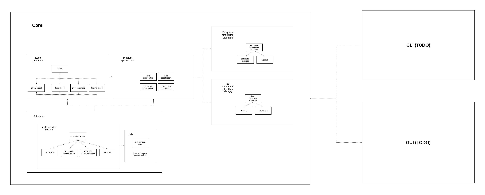

# System requirements
- Anaconda 2018.12 Python distribution or higher with a Python version 3.7 installed (Anaconda can be downloaded from: [https://www.anaconda.com/distribution/](https://www.anaconda.com/distribution/))

## Python environment libraries requirements
- Basic libraries installed by Anaconda
- scipi 1.2.0 or higher and all its dependencies
- matplotlib 3.0.2 or higher and all its dependencies
- jsonschema 3.0.1 or higher and all its dependencies
- progress 1.5 or higher and all its dependencies


## Usage
First of all, you need to fill the requirements listed in the above section

### Command line interface
Place in the project root folder

```bash
$ cd SchedulerFrameworkTCPN
```

Then execute the script called cli_launcher.py.
This script takes two arguments
- -f, --file: Path where find the JSON simulation description file. This file must accomplish the JSON SCHEMA specification located in ./cli/input-schema/input-schema.json, some examples are located in ./tests/cli
- -v, --verbose \[Optional\] : Display simulation progress and execution time

```bash
$ python cli_launcher.py
```

### Graphical user interface
Place in the project root folder

```bash
$ cd SchedulerFrameworkTCPN
```

Then execute the script called gui_launcher.py.
This script may take one argument
- -nt, --no-thermal: Open the GUI in no thermal mode, so the simulations only will show the scheduler behaviour.

```bash
$ python gui_launcher.py
```

# Architecture


# References
- [1] Original implementation of the code in matlab, [https://www.gdl.cinvestav.mx/art/uploads/SchedulerFrameworkTCPN.zip](https://www.gdl.cinvestav.mx/art/uploads/SchedulerFrameworkTCPN.zip )
- [2] Lineal Algebra libraries usage in scipi, [https://docs.scipy.org/doc/scipy/reference/tutorial/linalg.html](https://docs.scipy.org/doc/scipy/reference/tutorial/linalg.html)
- [3] JSON input format defined using JSON-SCHEMA, [https://json-schema.org/](https://json-schema.org/)