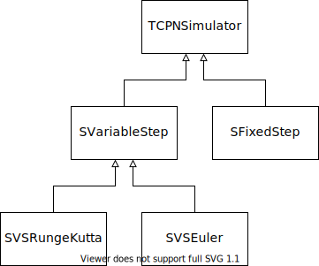
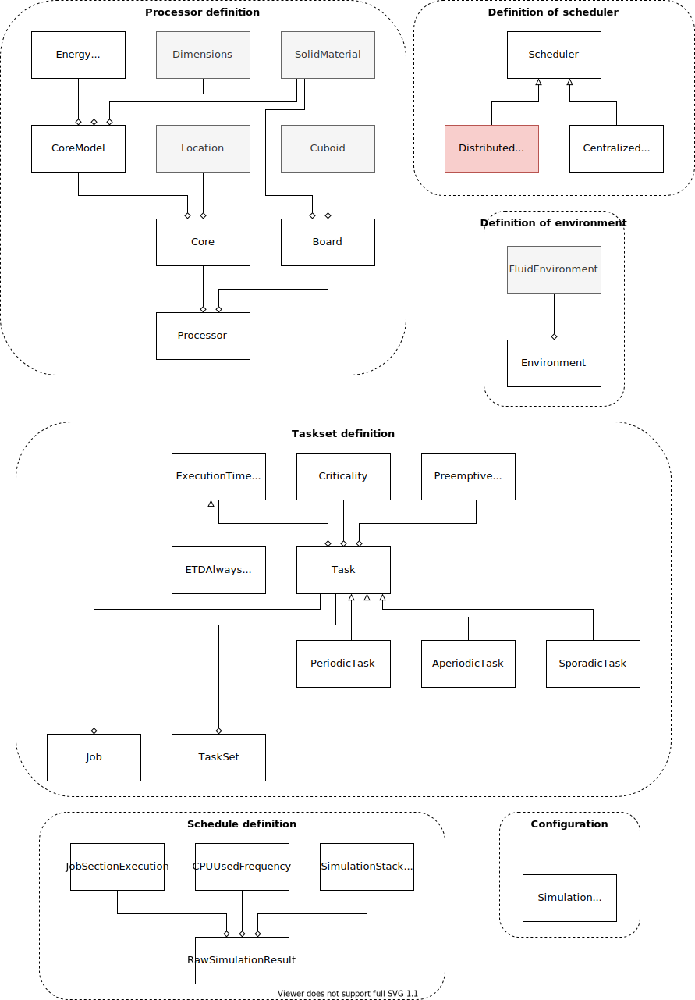
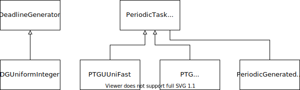
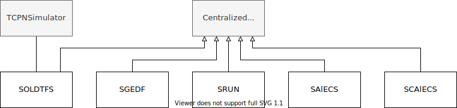
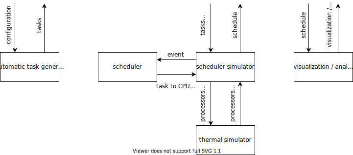

# Architecture of tertimuss
## Class diagrams
The package architecture of tertimuss is defined in the following UML diagram:

In the following diagrams define the architecture of the different packages.

### TCPN simulator

### Cubed space thermal simulator

### Scheduler simulation library

### Task generation algorithms

### Scheduler pack

## Simulation components
The following figure represents the architecture of tertimuss in execution time.

# Programming rules
Certain rules must be taken into account for the programing to avoid errors.
- No argument received can be modified unless the sole purpose of the function is to modify it. This allows arguments
  to be passed without making copies of them.