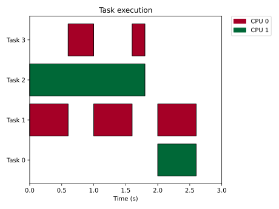
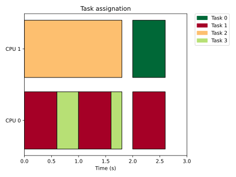
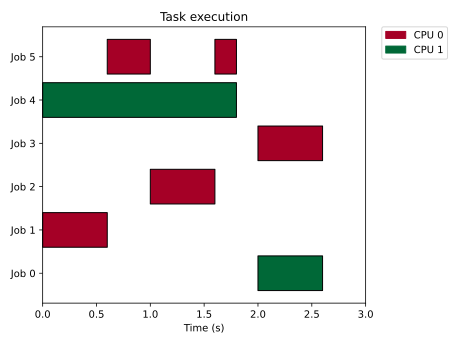
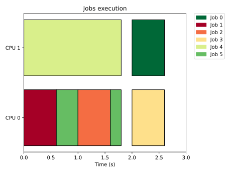

# Getting started

This section describes the main components of Tertimuss. This provides an overview of the library, gives an example simulation, and present the next topics to read to create your simulations.

Tertimuss is a compound of the following four components:

- __system specification__: The system specification is the definition of the environment with which the scheduler has to deal. It is formed by the task set specification (and the jobs specification), the processor specification, and the environment specification.

- __scheduling algorithm specification__: The scheduling algorithm specification is the implementation of the behavior of the scheduling algorithm to be used.

- __simulation type and configuration__: The simulation type and configuration allows to configure some elements in the simulation that affect its behavior, and the time it takes to simulate.

- __simulation result analyzer__: The simulation result analyzer is composed of a group of tools that provides an analysis of the behavior of the scheduler.

## Simulation definition example

First, we have a definition of a task set, composed of 4 fully preemptive hard real-time tasks with the following characteristics:

| Identifier | Type      | Period (seconds) | Relative deadline (seconds) | Worst case execution time (cycles) | First arrive (seconds) |
|----------------|-----------|------------------|-----------------------------|------------------------------------|------------------------|
| 1              | Periodic  | 1                | 1                           | 600                                | 0                      |
| 2              | Periodic  | 3                | 3                           | 1800                               | 0                      |
| 3              | Periodic  | 3                | 3                           | 600                                | 0                      |
| 0              | Aperiodic | -                | 1                           | 600                                | 2                      |

```python
# Tasks definition
periodic_tasks = [
    PeriodicTask(identifier=1,
                 worst_case_execution_time=600,
                 relative_deadline=1,
                 best_case_execution_time=None,
                 execution_time_distribution=None,
                 memory_footprint=None,
                 priority=None,
                 preemptive_execution=PreemptiveExecution.FULLY_PREEMPTIVE,
                 deadline_criteria=Criticality.HARD,
                 energy_consumption=None,
                 phase=None,
                 period=1),
    PeriodicTask(identifier=2,
                 worst_case_execution_time=1800,
                 relative_deadline=3,
                 best_case_execution_time=None,
                 execution_time_distribution=None,
                 memory_footprint=None,
                 priority=None,
                 preemptive_execution=PreemptiveExecution.FULLY_PREEMPTIVE,
                 deadline_criteria=Criticality.HARD,
                 energy_consumption=None,
                 phase=None,
                 period=3),
    PeriodicTask(identifier=3,
                 worst_case_execution_time=600,
                 relative_deadline=3,
                 best_case_execution_time=None,
                 execution_time_distribution=None,
                 memory_footprint=None,
                 priority=None,
                 preemptive_execution=PreemptiveExecution.FULLY_PREEMPTIVE,
                 deadline_criteria=Criticality.HARD,
                 energy_consumption=None,
                 phase=None,
                 period=3)
]

aperiodic_task = AperiodicTask(identifier=0,
                               worst_case_execution_time=600,
                               relative_deadline=1,
                               best_case_execution_time=None,
                               execution_time_distribution=None,
                               memory_footprint=None,
                               priority=None,
                               preemptive_execution=PreemptiveExecution.FULLY_PREEMPTIVE,
                               deadline_criteria=Criticality.HARD,
                               energy_consumption=None
                               )

aperiodic_tasks = [
    aperiodic_task
]

# Jobs definition for aperiodic tasks
aperiodic_jobs = [Job(0, aperiodic_task, 2)]

# Task set definition
task_set = TaskSet(
    periodic_tasks=periodic_tasks,
    aperiodic_tasks=aperiodic_tasks,
    sporadic_tasks=[]
)
```

Secondly, we have a processor definition with the following characteristics:

| Number of cores       | Available frequencies    |
|-----------------------|------|
| 2 | 1000 |

```python
base_frequency = 1000
available_frequencies = {base_frequency}
number_of_cores = 2
cpu_specification = generate_default_cpu(number_of_cores, available_frequencies)
```

## Running the simulation

The import need are the following:

```python
from tertimuss.analysis import obtain_deadline_misses_analysis, obtain_preemptions_migrations_analysis
from tertimuss.schedulers.g_edf import SGEDF
from tertimuss.simulation_lib.simulator import execute_scheduler_simulation_simple, SimulationConfiguration
from tertimuss.simulation_lib.system_definition import PeriodicTask, PreemptiveExecution, Criticality, AperiodicTask, TaskSet, Job
from tertimuss.simulation_lib.system_definition.utils import generate_default_cpu, default_environment_specification
from tertimuss.visualization import generate_task_execution_plot, generate_job_execution_plot, generate_task_assignation_plot, generate_job_assignation_plot
```

We simulate the behavior of __Global Earliest Deadline First__ scheduler over one major cycle with the following code chunk:

```python
# Execute simulation
simulation_result, periodic_jobs, major_cycle = execute_scheduler_simulation_simple(
    tasks=task_set,
    aperiodic_tasks_jobs=aperiodic_jobs,
    sporadic_tasks_jobs=[],
    processor_definition=cpu_specification,
    environment_specification=default_environment_specification(),
    simulation_options=SimulationConfiguration(id_debug=False),
    scheduler=SGEDF(activate_debug=False)
)
```

This returns 3 variables:

- The simulation result
- The jobs generated from the periodic tasks (they were generated automatically)
- The major cycle in seconds

## Generating an analysis from the simulation

First, we display the task execution:

```python
# Display tasks execution
fig = generate_task_execution_plot(task_set=task_set, schedule_result=simulation_result,
                                   title="Task execution",
                                   outline_boxes=True)
fig.show()
```



We can also plot the assignment of tasks to the CPU cores by the following way:

```python
# Display tasks assignation
fig = generate_task_assignation_plot(task_set=task_set, schedule_result=simulation_result,
                                     title="Task assignation",
                                     outline_boxes=True)
fig.show()
```



Then we obtain the jobs to tasks association:

```python
# Obtain tasks to jobs association
periodic_tasks_jobs_association = [(i.task.identifier, i.identifier) for i in periodic_jobs]
print(periodic_tasks_jobs_association)
```

| Task identifier | Job identifier |
|--------------------|---------------------|
| 1                  | 1                   |
| 1                  | 2                   |
| 1                  | 3                   |
| 2                  | 4                   |
| 3                  | 5                   |

And display the execution of the jobs:

```python
# Display jobs execution
fig = generate_job_execution_plot(task_set=task_set, schedule_result=simulation_result,
                                  jobs=periodic_jobs + aperiodic_jobs,
                                  title="Jobs execution",
                                  outline_boxes=True)
fig.show()
```



We can see that Job 5 has a preemption after the first second of execution.

As we did before for the tasks, we can plot the assignment of jobs to the CPU cores:

```python
# Display jobs assignation
fig = generate_job_assignation_plot(task_set=task_set, schedule_result=simulation_result,
                                    jobs=periodic_jobs + aperiodic_jobs,
                                    title="Jobs assignation",
                                    outline_boxes=True)
fig.show()
```



Then, we can obtain the number of preemptions of each job:
```python
 # Obtain migrations and preemption metrics
migration_preemption_metrics = obtain_preemptions_migrations_analysis(task_set=task_set,
                                                                      schedule_result=simulation_result,
                                                                      jobs=periodic_jobs + aperiodic_jobs)

print(migration_preemption_metrics.number_of_preemptions,
      migration_preemption_metrics.number_of_preemptions_by_job)
```

| Job identifier | Task identifier |
|--------------------|---------------------|
| 0                  | 1                   |
| 1                  | 1                   |
| 2                  | 1                   |
| 3                  | 1                   |
| 4                  | 1                   |
| 5                  | 2                   |

We can see that all jobs except 5 have only one preemption (mandatory) while job number 5 has two preemptions. 


## How to continue

The following tutorials look at the simulation components in more detail:

- System specification: There you learn how to define a system accordingly to your needs
- Scheduling algorithm specification: There you will learn more about the out of the box provided schedulers implementations, and how to define a new scheduler
- Simulation result analyzing: There you learn about the tools provided to analyze the scheduling behavior, and how you can create  a new personalized tool
- Running multiple simulations: There you learn how to run fast a big number of simulations. This is a need when you want to compare two schedulers and endorse the comparison with a statistical analysis of the behavior of the schedulers.
